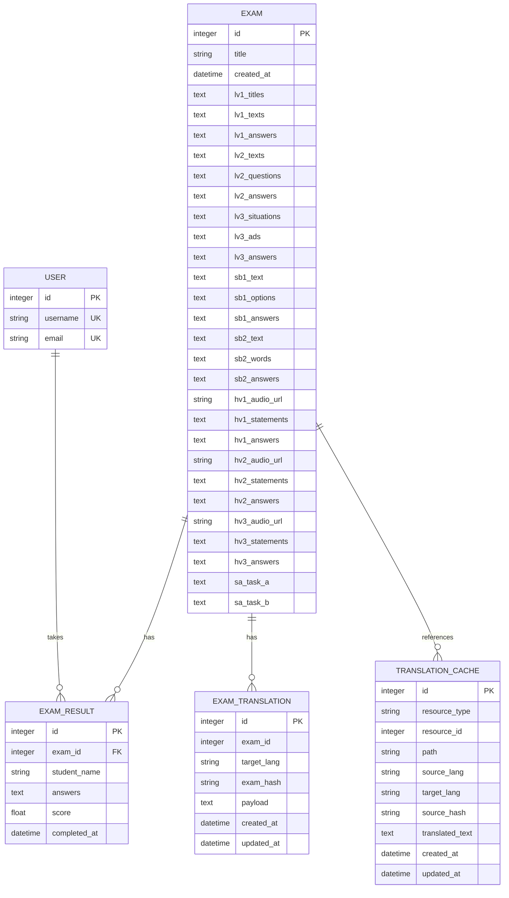

# TELC B2 Exam System - Database Schema Documentation

## Overview

The TELC B2 Exam System uses PostgreSQL as its primary database, leveraging its ACID compliance, JSON support, and robust performance. The schema is designed to efficiently store exam content, user data, results, and translation caches.

## Database Design Principles

1. **Flexibility**: JSON columns for variable exam content structure
2. **Performance**: Denormalized where appropriate for query speed
3. **Integrity**: Foreign key constraints for data consistency
4. **Scalability**: Designed for horizontal scaling with read replicas
5. **Audit Trail**: Timestamps on all tables for tracking

## Entity Relationship Diagram



## Table Specifications

### 1. `user` Table

Stores user account information (currently minimal, designed for future expansion).

```sql
CREATE TABLE user (
    id SERIAL PRIMARY KEY,
    username VARCHAR(80) UNIQUE NOT NULL,
    email VARCHAR(120) UNIQUE NOT NULL
);

-- Indexes
CREATE UNIQUE INDEX idx_user_username ON user(username);
CREATE UNIQUE INDEX idx_user_email ON user(email);
```

**Design Decisions:**
- No password field as authentication is token-based
- Ready for expansion with profile fields
- Unique constraints on both username and email

### 2. `exam` Table

Core table storing all exam content with flexible JSON structure.

```sql
CREATE TABLE exam (
    id SERIAL PRIMARY KEY,
    title VARCHAR(200) NOT NULL,
    created_at TIMESTAMP DEFAULT CURRENT_TIMESTAMP,
    
    -- Leseverstehen Teil 1 (Reading Part 1)
    lv1_titles TEXT,      -- JSON array of 10 titles (a-j)
    lv1_texts TEXT,       -- JSON array of 5 texts
    lv1_answers TEXT,     -- JSON array of 5 correct answers
    
    -- Leseverstehen Teil 2 (Reading Part 2)
    lv2_texts TEXT,       -- JSON array of longer texts
    lv2_questions TEXT,   -- JSON array of questions with options
    lv2_answers TEXT,     -- JSON array of correct answers
    
    -- Leseverstehen Teil 3 (Reading Part 3)
    lv3_situations TEXT,  -- JSON array of 10 situations
    lv3_ads TEXT,         -- JSON array of 12 advertisements (a-l)
    lv3_answers TEXT,     -- JSON array of correct matches
    
    -- Sprachbausteine Teil 1 (Language Elements Part 1)
    sb1_text TEXT,        -- Text with blanks marked as [BLANK_21] etc
    sb1_options TEXT,     -- JSON object with options per blank
    sb1_answers TEXT,     -- JSON array of correct answers
    
    -- Sprachbausteine Teil 2 (Language Elements Part 2)
    sb2_text TEXT,        -- Text with blanks
    sb2_words TEXT,       -- JSON array of 15 words (a-o)
    sb2_answers TEXT,     -- JSON array of correct word placement
    
    -- Hörverstehen (Listening Comprehension)
    hv1_audio_url VARCHAR(500),
    hv1_statements TEXT,  -- JSON array of statements 41-45
    hv1_answers TEXT,     -- JSON array of true/false
    
    hv2_audio_url VARCHAR(500),
    hv2_statements TEXT,  -- JSON array of statements 46-55
    hv2_answers TEXT,     -- JSON array of true/false
    
    hv3_audio_url VARCHAR(500),
    hv3_statements TEXT,  -- JSON array of statements 56-60
    hv3_answers TEXT,     -- JSON array of true/false
    
    -- Schriftlicher Ausdruck (Written Expression)
    sa_task_a TEXT,       -- Task description for formal letter
    sa_task_b TEXT        -- Task description for opinion essay
);

-- Indexes
CREATE INDEX idx_exam_created_at ON exam(created_at DESC);
```

**JSON Structure Examples:**

```json
// lv1_titles example
["Neue Wege in der Bildung", "Sport und Gesundheit", ...]

// lv2_questions example
[
    {
        "question": "Was ist die Hauptaussage des Textes?",
        "options": ["Option A", "Option B", "Option C"],
        "answer": "a"
    }
]

// sb1_options example
{
    "21": ["möchte", "will", "kann"],
    "22": ["aber", "und", "oder"]
}
```

### 3. `exam_result` Table

Stores student exam submissions and scores.

```sql
CREATE TABLE exam_result (
    id SERIAL PRIMARY KEY,
    exam_id INTEGER NOT NULL,
    student_name VARCHAR(100),
    answers TEXT,         -- JSON object with all answers
    score FLOAT,          -- Calculated total score
    completed_at TIMESTAMP DEFAULT CURRENT_TIMESTAMP,
    
    CONSTRAINT fk_exam 
        FOREIGN KEY(exam_id) 
        REFERENCES exam(id) 
        ON DELETE CASCADE
);

-- Indexes
CREATE INDEX idx_exam_result_exam_id ON exam_result(exam_id);
CREATE INDEX idx_exam_result_completed_at ON exam_result(completed_at DESC);
CREATE INDEX idx_exam_result_student_name ON exam_result(student_name);
```

**Answers JSON Structure:**
```json
{
    "1": "a",
    "2": "b",
    "3": "c",
    // ... questions 1-60
    "41": true,
    "42": false,
    // ...
    "schriftlicher_ausdruck_a": "Letter content...",
    "schriftlicher_ausdruck_b": "Essay content..."
}
```

### 4. `translation_cache` Table

Granular caching for individual field translations.

```sql
CREATE TABLE translation_cache (
    id SERIAL PRIMARY KEY,
    resource_type VARCHAR(50) NOT NULL,      -- 'exam', 'question', etc
    resource_id INTEGER NOT NULL,            -- ID of the resource
    path VARCHAR(255) NOT NULL,              -- 'lv1_titles[0]', etc
    source_lang VARCHAR(10) NOT NULL DEFAULT 'de',
    target_lang VARCHAR(10) NOT NULL,
    source_hash VARCHAR(64) NOT NULL,        -- SHA256 of source text
    translated_text TEXT NOT NULL,
    created_at TIMESTAMP DEFAULT CURRENT_TIMESTAMP,
    updated_at TIMESTAMP DEFAULT CURRENT_TIMESTAMP,
    
    CONSTRAINT uq_translation_cache_unique_entry 
        UNIQUE(resource_type, resource_id, path, 
               source_lang, target_lang, source_hash)
);

-- Indexes
CREATE INDEX idx_translation_cache_lookup 
    ON translation_cache(resource_type, resource_id, target_lang);
CREATE INDEX idx_translation_cache_hash 
    ON translation_cache(source_hash);
```

### 5. `exam_translation` Table

Complete translated exam payload cache.

```sql
CREATE TABLE exam_translation (
    id SERIAL PRIMARY KEY,
    exam_id INTEGER NOT NULL,
    target_lang VARCHAR(10) NOT NULL,
    exam_hash VARCHAR(64) NOT NULL,          -- Hash of entire exam content
    payload TEXT NOT NULL,                   -- Complete translated exam JSON
    created_at TIMESTAMP DEFAULT CURRENT_TIMESTAMP,
    updated_at TIMESTAMP DEFAULT CURRENT_TIMESTAMP,
    
    CONSTRAINT uq_exam_translation_latest 
        UNIQUE(exam_id, target_lang)
);

-- Indexes
CREATE INDEX idx_exam_translation_lookup 
    ON exam_translation(exam_id, target_lang);
```

## Migration Strategy

### Initial Migration (001_initial_postgresql_schema.py)

```python
def upgrade():
    # Create all tables with proper constraints
    # Add indexes for performance
    # Set up foreign key relationships
    
def downgrade():
    # Drop all tables in reverse order
    # Remove custom types if any
```

### Future Migrations

1. **Add User Authentication**
   ```sql
   ALTER TABLE user ADD COLUMN password_hash VARCHAR(255);
   ALTER TABLE user ADD COLUMN last_login TIMESTAMP;
   ```

2. **Add Exam Categories**
   ```sql
   CREATE TABLE exam_category (
       id SERIAL PRIMARY KEY,
       name VARCHAR(100) NOT NULL,
       description TEXT
   );
   ALTER TABLE exam ADD COLUMN category_id INTEGER 
       REFERENCES exam_category(id);
   ```

3. **Add Result Analytics**
   ```sql
   ALTER TABLE exam_result ADD COLUMN section_scores JSONB;
   ALTER TABLE exam_result ADD COLUMN time_spent INTEGER;
   ```

## Performance Optimization

### Indexing Strategy

1. **Primary Keys**: Automatically indexed
2. **Foreign Keys**: Indexed for JOIN performance
3. **Lookup Fields**: Username, email, timestamps
4. **Composite Indexes**: For multi-column queries

### Query Optimization

```sql
-- Example: Get recent results with exam info
EXPLAIN ANALYZE
SELECT 
    er.id,
    er.student_name,
    er.score,
    er.completed_at,
    e.title as exam_title
FROM exam_result er
JOIN exam e ON e.id = er.exam_id
WHERE er.completed_at > NOW() - INTERVAL '30 days'
ORDER BY er.completed_at DESC
LIMIT 20;
```

### Partitioning Strategy (Future)

For large-scale deployments:

```sql
-- Partition exam_result by year
CREATE TABLE exam_result_2024 PARTITION OF exam_result
    FOR VALUES FROM ('2024-01-01') TO ('2025-01-01');
    
CREATE TABLE exam_result_2025 PARTITION OF exam_result
    FOR VALUES FROM ('2025-01-01') TO ('2026-01-01');
```

## Data Integrity

### Constraints

1. **NOT NULL**: Critical fields like title, username
2. **UNIQUE**: Username, email, translation cache entries
3. **FOREIGN KEY**: exam_result → exam with CASCADE DELETE
4. **CHECK** (Future): Score ranges, valid languages

### Triggers (Future)

```sql
-- Auto-update updated_at timestamp
CREATE OR REPLACE FUNCTION update_updated_at()
RETURNS TRIGGER AS $$
BEGIN
    NEW.updated_at = CURRENT_TIMESTAMP;
    RETURN NEW;
END;
$$ LANGUAGE plpgsql;

CREATE TRIGGER update_translation_cache_updated_at
    BEFORE UPDATE ON translation_cache
    FOR EACH ROW
    EXECUTE FUNCTION update_updated_at();
```

## Backup and Recovery

### Backup Strategy

```bash
# Daily backup script
pg_dump -h localhost -U telc_user -d telc_exam_db \
    -f backup_$(date +%Y%m%d_%H%M%S).sql

# Backup with compression
pg_dump -h localhost -U telc_user -d telc_exam_db \
    -Fc -f backup_$(date +%Y%m%d).dump
```

### Recovery Procedures

```bash
# Restore from SQL backup
psql -h localhost -U telc_user -d telc_exam_db < backup.sql

# Restore from compressed backup
pg_restore -h localhost -U telc_user -d telc_exam_db backup.dump
```

## Security Considerations

### Access Control

```sql
-- Create read-only user for reporting
CREATE USER telc_reader WITH PASSWORD 'secure_password';
GRANT CONNECT ON DATABASE telc_exam_db TO telc_reader;
GRANT USAGE ON SCHEMA public TO telc_reader;
GRANT SELECT ON ALL TABLES IN SCHEMA public TO telc_reader;

-- Application user with full access
CREATE USER telc_app WITH PASSWORD 'secure_password';
GRANT ALL PRIVILEGES ON DATABASE telc_exam_db TO telc_app;
```

### Data Encryption (Future)

```sql
-- Encrypt sensitive data at rest
CREATE EXTENSION IF NOT EXISTS pgcrypto;

-- Example: Encrypt student answers
UPDATE exam_result 
SET answers = pgp_sym_encrypt(answers::text, 'encryption_key')
WHERE completed_at < NOW() - INTERVAL '90 days';
```

## Monitoring Queries

### Database Health

```sql
-- Table sizes
SELECT 
    schemaname,
    tablename,
    pg_size_pretty(pg_total_relation_size(schemaname||'.'||tablename)) as size
FROM pg_tables
WHERE schemaname = 'public'
ORDER BY pg_total_relation_size(schemaname||'.'||tablename) DESC;

-- Active connections
SELECT 
    pid,
    usename,
    application_name,
    client_addr,
    state,
    query_start,
    query
FROM pg_stat_activity
WHERE state != 'idle';

-- Slow queries
SELECT 
    query,
    calls,
    total_time,
    mean_time,
    max_time
FROM pg_stat_statements
ORDER BY mean_time DESC
LIMIT 10;
```

## Future Enhancements

1. **Full-Text Search**
   ```sql
   ALTER TABLE exam ADD COLUMN search_vector tsvector;
   CREATE INDEX idx_exam_search ON exam USING GIN(search_vector);
   ```

2. **JSONB Migration**
   ```sql
   -- Convert TEXT JSON columns to JSONB for better performance
   ALTER TABLE exam ALTER COLUMN lv1_titles TYPE JSONB USING lv1_titles::JSONB;
   ```

3. **Audit Tables**
   ```sql
   CREATE TABLE audit_log (
       id SERIAL PRIMARY KEY,
       table_name VARCHAR(50),
       operation VARCHAR(10),
       user_id INTEGER,
       changed_data JSONB,
       created_at TIMESTAMP DEFAULT CURRENT_TIMESTAMP
   );
   ```

---

Last updated: January 2024
Version: 1.0